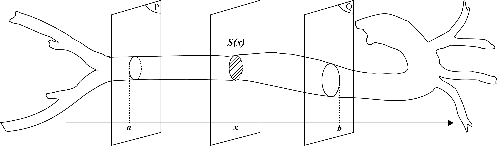
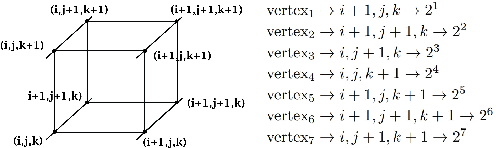

# Volume Computation of 3D Reconstructed Models from Volumetric Data Using Binary Indexed Tree

In the burgeoning field of medical imaging, precise computation of 3D volume holds a significant importance for subsequent qualitative analysis of 3D reconstructed objects. Combining multivariable calculus, marching cubes algorithm, and binary indexed tree data structure, we develop a algorithm for efficient computation of intrinsic volume of any volumetric data retrieved from computed tomography (CT) or magnetic resonance (MR). We proposed the 30 configurations of volume values based on polygonal mesh generation method. Our algorithm processes the data in scan-line order to initialize the Fenwick tree simultaneously with the reconstruction algorithm, ensuring faster volume query time following users edition such as slicing or transforming object mesh. We tested the algorithm's accuracy on simple 3D objects (e.g.sphere) to complicated structures (11 cardiac components). The result deviated slightly from labelled volume and there is still space for further improvement.

[Read Paper](https://github.com/VISEF-ISEF-team/Volume-Computation/blob/main/Paper.pdf)

  
|  |  |  |
|----------|----------|----------|
|  |  |  |
|  |  |  |

### 30 Volume Configurations
